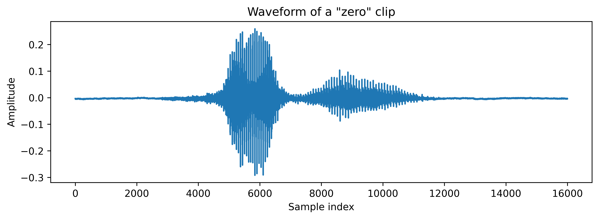
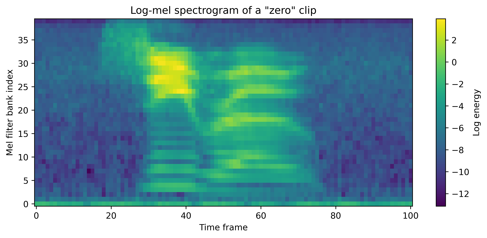

# 🎙️ VoiceCommand-CTC

> **Train a CTC-based speech recognizer on your own voice — from spoken digits to full voice commands.**

---

## 🚀 About This Project

**I built this for fun.**

This is a personal speech-to-text trainer powered by **CTC (Connectionist Temporal Classification)** loss. It learns spoken digits from the SC09 dataset, but the real goal is to train it on **my own voice** and grow it into a personal **AI assistant**.

I will keep training my model with my voice data and improve it to learn commands like:

> **yes, no, left, right, ok, find, check, wrong, fine, do it, rename, copy, delete**

Right now it nails the digits. Next, it learns my commands.

---

## ✨ Features

- 🎯 **CTC-based speech recognition** — no need for frame-level alignment
- 🔊 **Mel-spectrogram input** (40 mel bins, 16 kHz)
- 🧠 **2-layer Bi-GRU** architecture
- 🔍 **Beam search decoding** for accurate predictions
- 🎤 **Custom voice support** — drop your own `.wav` files into `my_voice/`
- 📈 **Live loss plots** and accuracy tracking inside the notebook
- ⚡ **Auto-setup** — clone, unzip, resample, and go. Just run the first 5 cells.

---

## 📊 Results

| Metric | Value |
|--------|-------|
| **Dataset** | SC09 (spoken digits 0–9) + custom `my_voice/` |
| **Test Accuracy (Beam Search)** | **~95.67%** on digit classification |
| **Model** | Bi-GRU + CTC |
| **Input** | 40-dim log-mel spectrogram |

### Visualizations

**Waveform of a spoken digit clip:**



**Log-Mel Spectrogram (what the model actually sees):**



---

## 🗂️ Repository Structure

```
.
├── CTC_sc09_training.ipynb   # Main training notebook
├── resample_to_16k.sh        # Audio preprocessing (auto-run by notebook)
├── sc09/                     # SC09 dataset (digits 0-9)
├── my_voice/                 # Your custom voice recordings
├── .image/                   # README images
│   ├── waveform.png
│   └── mel_spectrogram.png
└── README.md                 # This file
```

---

## 🛠️ Setup & Requirements

### 1. Install dependencies

```bash
pip install torch torchaudio matplotlib colorama
```

### 2. Name your voice files correctly

Place files directly inside `my_voice/` using this naming pattern:

```
yes_0_audio.wav
yes_1_audio.wav
no_0_audio.wav
left_0_audio.wav
right_0_audio.wav
ok_0_audio.wav
find_0_audio.wav
check_0_audio.wav
wrong_0_audio.wav
fine_0_audio.wav
doit_0_audio.wav      # "do it" → use "doit" (no space)
rename_0_audio.wav
copy_0_audio.wav
delete_0_audio.wav
```

> 💡 **Tip:** The more samples per command, the better. Aim for 100+ per word.

### 3. Run the notebook

Open `CTC_sc09_training.ipynb` and run the first 5 cells. The notebook will:
1. Clone the repo and extract data automatically
2. Resample all audio to 16 kHz mono via `resample_to_16k.sh`
3. Load SC09 digits + your `my_voice/` samples
4. Train with early stopping and learning rate scheduling
5. Evaluate with beam search decoding

> 🔧 **Note:** `resample_to_16k.sh` is included in the repo and executed automatically in the setup cells. No manual steps needed.

---

## 🧠 Model Architecture

```
Input Audio (16 kHz)
    ↓
Mel Spectrogram (40 bins)
    ↓
2-Layer Bi-GRU (hidden=128)
    ↓
Linear Classifier (num_classes = digits + commands + blank)
    ↓
CTC Loss / Beam Search Decode
    ↓
Predicted Word
```

---

## 🔮 Future Roadmap

- [x] Train on SC09 digits (0–9) @ 95%+ accuracy
- [ ] Expand vocabulary to 13+ voice commands
- [ ] Collect 3,000+ samples per custom command
- [ ] Build a real-time inference pipeline
- [ ] Package into a lightweight **AI Voice Assistant**

---

## 📝 Notes

- Built with **PyTorch** and **torchaudio**
- Trained on GPU (Google Colab T4) but works on CPU too
- This project is a **work in progress** — I update it as I record more voice data

---

## 👤 Author

Built for fun. Fork it, train it, talk to it.

---

*"I will make this into an AI assistant."*
